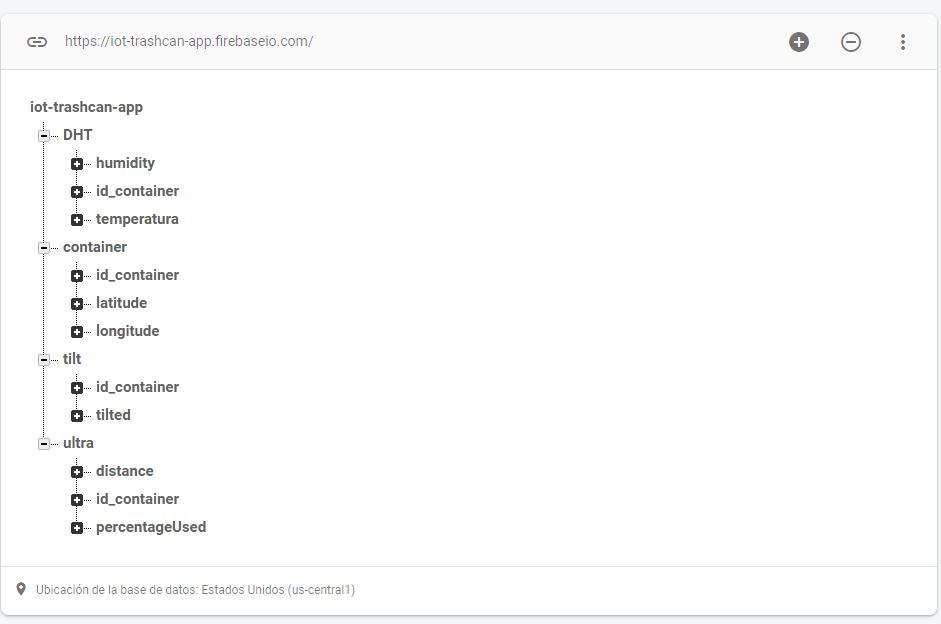
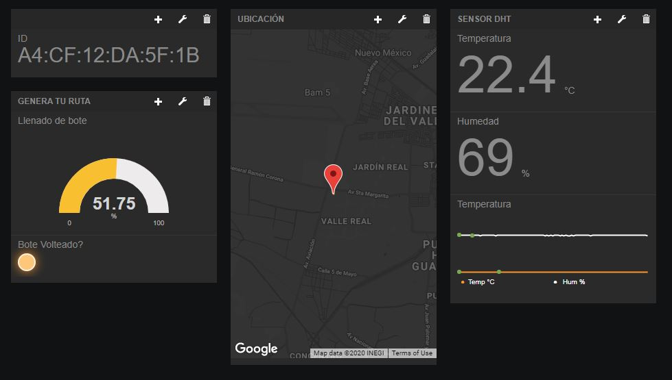

# Smart City
[](https://www.cplusplus.com/)
[](https://firebase.google.com/)
[](https://www.arduino.cc/)
## Members
- [Rafael Jimenez](https://github.com/rafaeljimenez01)
- [Joshua Hernandez](https://github.com/josh-hdz)
- [Oswaldo Hernandez](https://github.com/OSWA00)
- [Oscar Miranda](https://github.com/oscarmires)


## What are you interested in?
<details open="open">
  <summary>Table of Contents</summary>
  <ol>
    <li>
      <a href="#about-the-project">About The Project</a>
    </li>
    <li>
      <a href="#getting-started">Getting Started</a>
      <ul>
        <li><a href="#prerequisites">Prerequisites</a></li>
        <li><a href="#script utilization">Script Utilization</a></li>
      </ul>
    </li>
    <li><a href="#project-overview">Project Overview</a></li>
    <li><a href="#license">License</a></li>
    <li><a href="#contact">Contact</a></li>
    <li><a href="#acknowledgements">Acknowledgements</a></li>
  </ol>
</details>


## About The Project


The main purpouse of the project is to gather information from every trashcan in a cheap and efficient way.

Here's why:
* Trash recollection mismanagment is an issue that affects everybody in the city but we believe it can be fixed with data! 
* Mismanaged garbage generates floods, traffic and possible health problems.

Gathering information is just a part of the project. In the future we would like to analyze the data in order to desing better,healthier and more efficient cities

A list of commonly used resources that I find helpful are listed in the acknowledgements.
## Getting Started
To set up the circuit you will need:
<ul>
  <li>Node ESP8266</li>
  <li>DHT sensor</li>
  <li>Tilt sensor</li>
  <li>Ultrasonic sensor</li>
</ul>

### Prerequisites

1. You will need to connect every sensor to the ESP8266 and be aware of which pins you are using.

2. Modify script to match the pins you are using for every sensor
```c++
  #define Trig    D0
  #define Echo    D1
  #define DHTPin  D3
  #define LED     D5
  #define TiltS   D8
```

Please note: 
  Trig & Echo are for the ultrasonic sensor

3. In order to connect to wifi. The node ESP8266 will go into hotspot mode and you should connect to it utilizing your phone. It may show a pop up asking you to connect to any nearby wifi, please connect this will give the microchip your wifi information. If no pop-up is shown please open try to open any website on your phone.

4. LED should blink and then stay on - showing you the chip is connected to wifi

### Script Utilization
1. Create a realtime database in Firebase.
 
2. Modify this part of the script to your own information
```c++
  #define FIREBASE_HOST "iot-trashcan-app.firebaseio.com/"
  #define FIREBASE_AUTH "sdv5W0uduPp3BdFo1dUCpEuRqVLaMuQm619lgUaA"
```
3. The database will format itself as information continues to arrive

4. If you want to use Freeboard.io to visualize the information via a dashboard you will need to setup a Dweet.io and plug it here
```c++
  const char* host = "www.dweet.io";
  const char* thing = "prueba_NodeMCU_rafa"; //Change for your name
```
5. Enter [freeboard.io](https://freeboard.io/) and select dweet as the source of information.

## Project Overview

The realtime database was created in firebase and has the following structure:



The information is also showed in a dashboard utilizg Dweet.io and Freeboard.io:


## License

Distributed under the MIT License. See `LICENSE` for more information.

## Contact

Rafael Jimenez - [@01RafaelJimenez](https://https://twitter.com/01RafaelJimenez) - rafaeljimenez_01@hotmail.com

Project Link: [https://github.com/your_username/repo_name](https://github.com/rafaeljimenez01/iot-trashcan-tracking)

## Acknowledgements
* [README template](https://github.com/othneildrew/Best-README-Template)